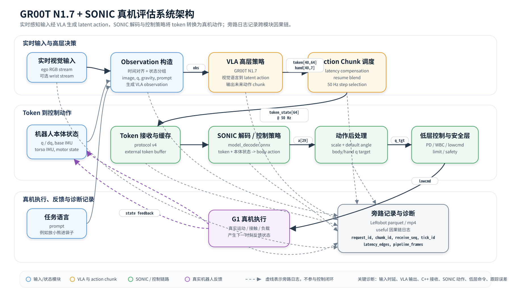
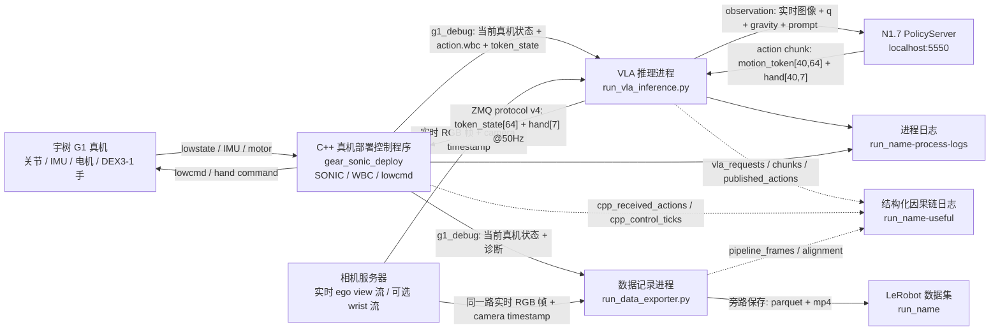
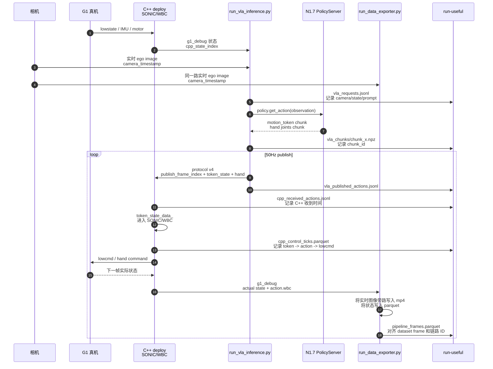
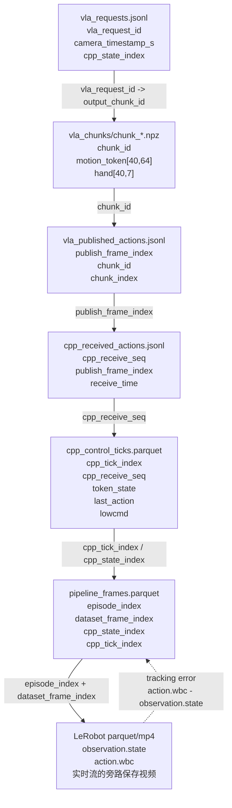

# N1.7 + SONIC 真机 Eval Pipeline 与 Useful 日志设计

本文档目标：

1. 明确当前 N1.7 + SONIC 真机 eval 的整体 pipeline。
2. 说明当前 `2026-06-12-15-58-12` 和 `2026-06-12-15-58-12-process-logs` 已经保存了什么。
3. 设计下次真机评估时新增的平行日志目录，例如：

```text
outputs/2026-06-12-15-58-12
outputs/2026-06-12-15-58-12-process-logs
outputs/2026-06-12-15-58-12-useful
```

`*-useful` 的定位不是替代 LeRobot 数据集，而是记录“系统链路因果关系”：输入是什么、什么时候进 VLA、VLA 输出是什么、什么时候发给 C++/SONIC、SONIC/WBC 最终生成什么动作、真机有没有跟上。

## 0. 图示版 Pipeline

### 0.1 模块级架构图

这张图按“系统/算法模块”抽象，不按 Python/C++ 进程划分。真实实现里有些模块在 Python 进程，有些在 C++ 控制程序里，但 failure debug 时更应该关心模块之间的输入输出。



图注建议：

```text
GR00T N1.7 + SONIC real-robot evaluation pipeline. Real-time RGB observations and robot proprioception are converted into VLA observations. The VLA predicts latent motion-token chunks, which are scheduled at 50 Hz and consumed by the SONIC decoder/control policy to produce whole-body targets. Dashed links indicate side-channel logging used for failure diagnosis.
```

一句话版：

```text
实时图像 + 真机本体状态 + prompt
  -> VLA 生成未来 40 步 latent token
  -> 调度器按 50Hz 取当前 token
  -> SONIC decoder/控制策略把 token + 本体状态变成 body action
  -> 后处理得到关节目标
  -> 低层控制驱动 G1
  -> 真机状态反馈回下一轮
```

### 0.2 模块输入输出表

| 模块 | 输入 | 输出 | 下次 useful 必须保存 |
|---|---|---|---|
| 实时视觉输入 | ego RGB 实时流；可选 wrist 实时流 | 当前图像帧、`camera_timestamp_s` | `camera_timestamp_s`, `camera_age_ms`, `image_ref`, 异常时 debug snapshot |
| 机器人本体状态 | Unitree lowstate、secondary IMU、Dex3 hand state、motor state | `q/dq`, base/torso IMU, motor torque/error/temp | `cpp_state_index`, `cpp_state_timestamp_s`, q/dq/IMU/motor 关键摘要 |
| Observation 构造与时间对齐 | 实时图像、机器人状态、prompt、机器人模型 | VLA observation：图像、语言、分组后的 state、`projected_gravity` | `vla_request_id`, 输入图像 timestamp、输入 state index、prompt、observation ready time |
| VLA 高层策略 `GR00T N1.7` | VLA observation | `motion_token[1,40,64]`, `left_hand_joints[1,40,7]`, `right_hand_joints[1,40,7]` | `vla_request_id`, `chunk_id`, raw action shapes, inference start/end, `policy_total_ms` |
| Action Chunk 调度器 | VLA chunk、inference latency、resume blend 状态、50Hz publish rate | 每 20ms 一个 `token_state[64]`、左右手目标、`publish_frame_index` | `chunk_id`, `chunk_index`, `publish_frame_index`, `blend_alpha`, 实际发布 token/hand |
| Token 接收与缓存 | protocol v4 ZMQ action：`token_state`, hand targets, frame index | C++ 侧 external token buffer / `token_state_data_` | `cpp_receive_seq`, `publish_frame_index`, receive time, decode status, token norm |
| SONIC decoder / 控制策略 | `token_state_data_`、当前/历史本体状态、上一时刻 action、重力/IMU 等 observation | raw body action，通常是 29 DoF body action | `cpp_tick_index`, token age, raw body action, policy/decoder inference time |
| 动作后处理与目标生成 | raw body action、scale、default angle、手部目标 | body q target、hand q target、`action.wbc` | raw action、scaled action、default offset 后 q target、hand target |
| 低层控制与安全层 | q target、PD/WBC 参数、safety/limit、当前真机状态 | lowcmd、hand command、可能的限幅/安全修改 | lowcmd q/kp/kd/tau、safety flags、limit/clamp 信息 |
| G1 真机执行与反馈 | lowcmd、真实物理接触、负载、延迟 | 下一时刻真机状态、tracking error | `observation.state`, motor torque/error, `action.wbc - observation.state` |
| 旁路记录与诊断 | 各模块 ID、时间戳、关键张量摘要 | LeRobot 数据集、process logs、`*-useful` 因果链日志 | `pipeline_frames.parquet`, `latency_edges.parquet`, alignment report |

注意：`mp4` 只是实时视觉输入的旁路保存结果，不是 VLA 的输入源。VLA 读取的是 camera server 的实时帧；debug 时用 `camera_timestamp_s` 和 `image_ref` 把“VLA 当时看到的实时帧”对齐到事后保存的 mp4 帧。

### 0.3 实现/进程映射图



直观理解：

```text
G1 + 实时相机流
  -> VLA 看当前实时画面和机器人状态
  -> N1.7 输出未来 40 步 token
  -> Python 每 20ms 取一步 token 发给 C++
  -> C++/SONIC/WBC 把 token 变成关节目标
  -> 真机执行
  -> exporter 旁路记录实际结果和实时相机帧，事后保存成 parquet/mp4
```

### 0.4 单个 action 的时序图



这张图里真正要抓的就是几条延迟：

```text
实时 camera/state -> VLA request
VLA request -> VLA response
VLA publish -> C++ receive
C++ receive -> token 被控制 tick 使用
token -> SONIC/WBC action
action -> 真机实际状态变化
```

### 0.5 Useful 日志如何串起来



调试时的查询方向：

```text
异常视频帧，也就是实时相机流被旁路保存后的 mp4 帧
  -> pipeline_frames 找到 cpp_tick_index / chunk_id
  -> vla_requests 看 VLA 当时用的实时输入是否 stale
  -> vla_chunks 看模型输出是否异常
  -> vla_published_actions 看 Python 发了什么
  -> cpp_received_actions 看 C++ 有没有收到
  -> cpp_control_ticks 看 SONIC/WBC 变成了什么动作
  -> LeRobot parquet 看真机有没有跟上
```

## 1. 当前整体 Pipeline

当前 eval 是一个多进程系统。核心进程包括：

| 模块 | 进程 / 脚本 | 作用 |
|---|---|---|
| 真机部署控制程序 | `gear_sonic_deploy/deploy.sh ... real` | C++ 控制进程。读取 Unitree 状态、接收 VLA token、运行 SONIC/WBC 控制、发布真机命令、发布 `g1_debug` 状态 |
| VLA 推理 | `gear_sonic/scripts/run_vla_inference.py` | Python 进程。读取相机和机器人状态，调用 N1.7 PolicyServer，输出 motion token 和手部目标 |
| N1.7 PolicyServer | `localhost:5550` | GR00T N1.7 policy server，输入 observation，输出 action chunk |
| 数据记录 | `gear_sonic/scripts/run_data_exporter.py` | Python 进程。订阅 C++ 状态、相机、SONIC/pose/planner、键盘，保存 LeRobot 数据集 |
| 键盘控制 | keyboard publisher | 发布 `k/i/p/c/s/f` 等控制事件 |

当前 run 的配置来自：

```text
outputs/2026-06-12-15-58-12-process-logs/run_manifest.json
```

关键配置：

| 配置 | 值 |
|---|---|
| prompt | `Put the teddy bear in the bag.` |
| policy server | `localhost:5550` |
| embodiment | `unitree_g1_sonic` |
| action horizon | `40` |
| action publish rate | `50 Hz` |
| camera | `192.168.123.164:5555` |
| C++ input type | `zmq_manager` |
| C++ ZMQ host | `localhost` |

## 2. Pipeline 分段解释

### 2.1 真机状态进入系统

C++ 控制程序从 Unitree SDK 读取：

| 信号 | 来源 | 当前保存位置 |
|---|---|---|
| body 29 DoF 关节位置 / 速度 | Unitree lowstate | parquet: `observation.state`, `observation.velocity` 的 body 部分 |
| DEX3-1 左右手 7+7 DoF | Dex3 hand state | parquet: `observation.state`, `observation.velocity` 的 hand 部分 |
| base 主 IMU | `lowstate.imu_state()` | parquet: `observation.root_orientation`, `base_angular_velocity`, `base_acceleration` |
| torso IMU | `rt/secondary_imu` | parquet: `observation.torso_orientation`, `torso_angular_velocity`, `torso_acceleration` |
| motor torque / temp / error | motor state | parquet: `motor_torque`, `motor_temperature`, `motor_error` |

C++ 通过 ZMQ 发布 `g1_debug`。VLA 推理进程和 data exporter 都会订阅这个状态。

### 2.2 实时相机流进入 VLA

真机 eval 时，VLA 推理进程读取的是 camera server 的实时相机流，不是保存后的 mp4：

```text
ComposedCameraClientSensor(camera_host=192.168.123.164, camera_port=5555)
```

当前实时输入主要包括：

| 输入 | 当前情况 |
|---|---|
| ego view RGB 实时流 | VLA 实时读取；data exporter 同时旁路保存为 mp4 |
| wrist camera 实时流 | 当前 `record_wrist_cameras=false`，VLA/记录侧都没有使用或保存 |
| depth / point cloud | 当前没有 |

VLA observation 里会包含：

```text
video.ego_view，也就是当前实时 ego image
language prompt
robot q
projected_gravity
left/right arm
left/right leg
waist
left/right hand
```

注意：当前数据集里的 ego mp4 是 data exporter 对实时相机流的事后旁路保存，不是 VLA 的输入源。当前缺少的是“某次 VLA request 当时使用的实时 camera timestamp / image frame id / image hash，以及它对应保存 mp4 中的哪一帧”。

### 2.3 VLA / N1.7 推理

`run_vla_inference.py` 中的 VLA 调用链：

```text
prepare_observation_from_sensors()
  -> policy.get_action(observation)
  -> concat_action()
```

N1.7 输出 action chunk。当前 latent protocol v4 主要输出：

| 输出 | shape | 含义 |
|---|---:|---|
| `motion_token` | `(1, 40, 64)` | 40 步未来 motion token |
| `left_hand_joints` | `(1, 40, 7)` | 40 步左手目标 |
| `right_hand_joints` | `(1, 40, 7)` | 40 步右手目标 |

当前 process logs 已保存这些 chunk：

```text
outputs/...-process-logs/inference_trace/chunks/chunk_*.npz
```

并保存：

```text
inference_trace/events.jsonl
inference_trace/published_actions.jsonl
```

但当前缺少：

| 缺失 | 为什么关键 |
|---|---|
| 每次 VLA request 的 observation 元信息 | 不知道 VLA 当时到底用了哪一帧实时图像、哪一帧机器人状态 |
| camera timestamp 与 state timestamp | 无法判断 VLA 的实时输入是否已经 stale |
| policy request start / end / receive 的完整时间 | 只能粗略知道 inference_ms，无法拆出排队、采样、网络、server 计算 |
| raw policy action key 列表和 shape | 出问题时难判断模型输出字段是否异常 |

### 2.4 VLA 输出发布给 C++ / SONIC

VLA 推理进程从 action chunk 中按 50 Hz 逐步取出当前 step，并发布 ZMQ protocol v4：

```text
topic: pose
version: 4
fields:
  token_state: float32[1, 64]
  frame_index: int64[1]
  left_hand_joints: float32[1, 7]
  right_hand_joints: float32[1, 7]
```

当前已保存：

```text
inference_trace/published_actions.jsonl
```

里面有：

| 字段 | 含义 |
|---|---|
| `time_unix_s`, `time_monotonic_s` | Python 发布 action 的时间 |
| `chunk_id` | 来自哪个 VLA chunk |
| `chunk_index` | 使用该 chunk 的第几个 step |
| `frame_index` | VLA 发布侧 frame index |
| `blend_alpha` | resume blend 阶段的插值权重 |
| `motion_token` | 实际发布给 C++ 的 64 维 token |
| `left_hand_joints`, `right_hand_joints` | 实际发布给 C++ 的手部目标 |

这部分已经不错，但缺少 C++ 接收确认。现在只能知道 Python “发了”，不知道 C++ “什么时候收到、是否成功 decode、什么时候进入控制 tick”。

### 2.5 C++ 接收 token 并进入 SONIC/WBC

C++ 的 `ZMQEndpointInterface` 收到 protocol v4 后：

1. decode `token_state`
2. decode `left_hand_joints` / `right_hand_joints`
3. 保存为 external token state
4. 后续控制循环把 external token copy 到 `token_state_data_`
5. SONIC/WBC policy 使用 `token_state_data_` 和机器人状态，生成 body `last_action`
6. hand target 单独进入左右手 action

当前 parquet 中保存了结果：

| parquet 字段 | 含义 |
|---|---|
| `action.motion_token` | C++ 当前 token_state |
| `action.wbc` | C++ 发布出的 body + hand 目标姿态，已转为 43 DoF |
| `observation.state` | 真机实际 43 DoF |
| `diagnostic.sonic_age_ms` | data exporter 侧看到的 SONIC/pose/planner age，不是完整 VLA->C++->WBC 延迟 |

但当前缺少：

| 缺失 | 为什么关键 |
|---|---|
| C++ receive timestamp | 无法计算 Python publish -> C++ receive 延迟 |
| C++ decode result | 无法判断 token 是否丢失、shape 错误、协议变更 |
| token copy 到 `token_state_data_` 的 tick 时间 | 无法知道 token 什么时候真正被控制器使用 |
| SONIC/WBC inference/控制耗时 | 无法判断控制侧是否卡顿 |
| raw `last_action` 和 scaled `last_action` | 当前 parquet 保存的是最终目标，不够拆解 |
| safety / saturation / clamp | 失败时不知道动作是否被限幅、安全层截断 |

### 2.6 最终动作与真机实际执行

当前可以比较：

```text
action.wbc - observation.state
```

这能得到 tracking error，也就是“控制目标”和“真机实测姿态”的差距。

但为了知道为什么失败，还需要把这条差距往前追：

```text
视觉输入是否正确
  -> VLA 输出 token 是否异常
  -> token 是否及时进入 C++
  -> SONIC/WBC 是否生成异常目标
  -> 目标是否被限幅/安全层修改
  -> 真机是否因力矩/接触/时延跟不上
```

这就是 `*-useful` 需要补的内容。

## 3. 下次新增 `*-useful` 目录设计

建议目录：

```text
outputs/<run_name>-useful/
  manifest.json
  pipeline_events.jsonl
  pipeline_frames.parquet
  latency_edges.parquet
  vla_requests.jsonl
  vla_chunks/
    chunk_000000.npz
    ...
  vla_published_actions.jsonl
  cpp_received_actions.jsonl
  cpp_control_ticks.parquet
  alignment_report.md
  README.md
```

第一版可以先保存 JSONL + NPZ，后面再转 parquet。

## 4. 必须保存的核心链路 ID

要把全链路串起来，必须引入几个稳定 ID：

| ID | 生成位置 | 用途 |
|---|---|---|
| `run_id` | launcher | 标识本次评估 |
| `episode_index` | data exporter | 对齐 LeRobot episode |
| `dataset_frame_index` | data exporter | 对齐 parquet/video |
| `vla_request_id` | VLA 推理进程 | 标识一次 policy.get_action |
| `chunk_id` | VLA 推理进程 | 标识一次 VLA 输出 chunk |
| `publish_frame_index` | VLA 推理进程 | 标识一次发给 C++ 的 protocol v4 action |
| `cpp_receive_seq` | C++ ZMQ receiver | 标识 C++ 收到的第几条 action |
| `cpp_tick_index` | C++ control loop | 标识控制循环 tick |
| `cpp_state_index` | C++ StateLogger | 对齐当前 `diagnostic.cpp_state_index` |

没有这些 ID，只靠时间戳会很痛苦；有这些 ID 后，延迟和因果链都能自动 join。

## 5. 时间戳规范

每条 useful 日志都应该保存：

| 字段 | 含义 |
|---|---|
| `time_unix_s` | wall clock，方便和已有日志对齐 |
| `time_monotonic_s` | 单机进程内高精度延迟计算 |
| `source_process` | `vla`, `cpp`, `exporter`, `camera` 等 |
| `source_thread` | 可选，区分 worker / main / control loop |

如果不同机器参与，必须增加 clock sync；当前大部分进程在同机 `jg` 上，`time_monotonic_s` 对同机 Python/C++ 也仍需谨慎，因为各进程 monotonic 起点一致但记录接口不同，建议同时保存 `time_unix_s`。

## 6. `vla_requests.jsonl`

每次 VLA 调用前后保存一行。

建议 schema：

| 字段 | 类型 | 含义 |
|---|---|---|
| `vla_request_id` | int | 第几次 VLA 请求 |
| `trigger_time_unix_s` | float | 决定触发 inference 的时间 |
| `obs_ready_time_unix_s` | float | observation 准备完成时间 |
| `policy_request_start_unix_s` | float | 调用 `policy.get_action` 前 |
| `policy_response_time_unix_s` | float | `policy.get_action` 返回后 |
| `policy_total_ms` | float | VLA 总耗时 |
| `prompt` | string | 当前 prompt |
| `camera_timestamp_s` | float | VLA request 使用的实时 ego image timestamp |
| `camera_age_ms` | float | VLA request 时实时图像 age |
| `cpp_state_index` | int | 使用的 C++ state index |
| `cpp_state_timestamp_s` | float | 使用的 C++ state wall timestamp |
| `state_age_ms` | float | VLA request 时状态 age |
| `qpos_norm` | float | 输入 q 的 norm |
| `projected_gravity` | list[3] | 输入重力投影 |
| `image_ref` | string | 指向实时帧的旁路引用，例如保存 mp4 的 episode/frame，或异常时保存的 debug image |
| `image_hash` | string | 可选，验证 VLA 当时使用的实时输入图像 |
| `output_chunk_id` | int | 返回后对应的 chunk |
| `status` | string | `ok`, `observation_missing`, `policy_error`, `action_bound_violation` |

第一版不一定要保存每次完整图片，因为 VLA 用的是实时流，data exporter 会旁路保存成 mp4。至少保存：

```text
camera_timestamp_s
image_ref
image_hash
```

异常时再额外保存 VLA request 当时用到的实时图像 PNG/JPG snapshot。

## 7. `vla_chunks/chunk_*.npz`

当前已有类似内容，可以沿用并增强。

必须保存：

| key | shape | 含义 |
|---|---:|---|
| `motion_token` | `(1, 40, 64)` | VLA 原始输出 token chunk |
| `left_hand_joints` | `(1, 40, 7)` | VLA 左手输出 |
| `right_hand_joints` | `(1, 40, 7)` | VLA 右手输出 |

建议增加：

| key | shape | 含义 |
|---|---:|---|
| `raw_motion_token` | 原始 shape | policy.get_action 原始输出，未处理 |
| `processed_motion_token` | `(1, 40, 64)` | concat/规范化后输出 |
| `selected_start_index` | scalar | latency compensation 后从第几步开始执行 |
| `first_after_resume` | scalar bool | 是否 resume 后第一段 |

对应 JSONL 事件应写：

```json
{
  "event": "vla_chunk",
  "vla_request_id": 12,
  "chunk_id": 12,
  "npz_file": "vla_chunks/chunk_000012.npz",
  "policy_total_ms": 312.4,
  "selected_start_index": 16
}
```

## 8. `vla_published_actions.jsonl`

当前 `published_actions.jsonl` 已经接近可用。建议下一版保留并加字段：

| 字段 | 当前有无 | 含义 |
|---|---|---|
| `publish_frame_index` | 有，叫 `frame_index` | VLA 发布侧逐帧 index |
| `chunk_id` | 有 | 来自哪个 chunk |
| `chunk_index` | 有 | 用 chunk 第几步 |
| `vla_request_id` | 建议新增 | 来自哪次 VLA request |
| `publish_time_unix_s` | 有 | Python send 前后时间 |
| `send_duration_ms` | 建议新增 | ZMQ send 耗时 |
| `blend_alpha` | 有 | resume blend 权重 |
| `motion_token` | 有 | 实际发给 C++ 的 token |
| `left_hand_joints` | 有 | 实际发给 C++ 的左手目标 |
| `right_hand_joints` | 有 | 实际发给 C++ 的右手目标 |

## 9. `cpp_received_actions.jsonl`

这是下一版最该补的日志。每次 C++ 收到 protocol v4 action 时写一行。

建议 schema：

| 字段 | 类型 | 含义 |
|---|---|---|
| `cpp_receive_seq` | int | C++ 接收序号 |
| `time_unix_s` | float | C++ 收到消息时间 |
| `time_monotonic_s` | float | C++ monotonic 时间 |
| `protocol_version` | int | 应为 4 |
| `publish_frame_index` | int | Python 发来的 frame_index |
| `token_dim` | int | 应为 64 |
| `token_norm` | float | token norm |
| `token_first` | float | token[0]，便于快速核对 |
| `token_state` | list[64] 或 npz ref | 完整 token |
| `left_hand_joints` | list[7] | C++ decode 后左手 |
| `right_hand_joints` | list[7] | C++ decode 后右手 |
| `decode_ms` | float | decode 耗时 |
| `status` | string | `ok`, `missing_token`, `bad_shape`, `protocol_changed` |

有了这个就能算：

```text
VLA publish -> C++ receive
```

## 10. `cpp_control_ticks.parquet`

每个 C++ 控制 tick 保存一行。字段可以先分成标量 parquet + 大数组 npz，避免 JSONL 太大。

建议字段：

| 字段 | 类型 / shape | 含义 |
|---|---|---|
| `cpp_tick_index` | int | 控制 tick index |
| `time_unix_s` | float | tick 时间 |
| `cpp_state_index` | int | StateLogger index |
| `latest_cpp_receive_seq` | int | 当前使用的最新 token 接收序号 |
| `latest_publish_frame_index` | int | 当前使用的 VLA 发布 frame |
| `token_age_ms` | float | 当前 token 从 C++ 接收到被使用的 age |
| `token_state` | float[64] | 当前进入 SONIC/WBC 的 token |
| `body_q_actual` | float[29] | 真机 body 实测 |
| `body_dq_actual` | float[29] | 真机 body 速度 |
| `left_hand_q_actual` | float[7] | 左手实测 |
| `right_hand_q_actual` | float[7] | 右手实测 |
| `last_action_raw` | float[29] | SONIC/WBC policy 原始 body action，scale/offset 前 |
| `last_action_scaled` | float[29] | scale + default offset 后 body action |
| `last_left_hand_action` | float[7] | 左手目标 |
| `last_right_hand_action` | float[7] | 右手目标 |
| `lowcmd_q_target` | float[29] | 实际发给低层的 q target |
| `lowcmd_tau_ff` | float[29] | feedforward torque，如果有 |
| `motor_torque` | float[29] | 实测 torque |
| `motor_error` | float[29] | motor error |
| `base_quat` | float[4] | base IMU |
| `torso_quat` | float[4] | torso IMU |
| `control_compute_ms` | float | 本 tick 控制计算耗时 |
| `policy_inference_ms` | float | SONIC/WBC ONNX 推理耗时 |
| `command_publish_ms` | float | DDS command publish 耗时 |
| `safety_flags` | string/list | 限幅、急停、温度、token timeout 等 |

这张表是失败分析的核心。它能回答：

```text
token 进来后，SONIC/WBC 到底生成了什么动作？
这个动作有没有被 scale、offset、clamp、安全层修改？
真机实际有没有跟上？
```

## 11. `pipeline_frames.parquet`

这是把 exporter 的 LeRobot frame 和 useful 链路串起来的索引表。每个 dataset frame 一行，不需要保存大数组，只保存 ID 和延迟。

建议字段：

| 字段 | 含义 |
|---|---|
| `episode_index` | LeRobot episode |
| `dataset_frame_index` | episode 内 frame |
| `dataset_global_index` | 全局 index |
| `dataset_timestamp_s` | episode 内时间 |
| `camera_timestamp_s` | 对应图像时间 |
| `cpp_state_index` | 对应 C++ state |
| `vla_request_id` | 最近一次生成当前 chunk 的 request |
| `chunk_id` | 当前使用的 VLA chunk |
| `chunk_index` | 当前 step |
| `publish_frame_index` | VLA 发布 frame |
| `cpp_receive_seq` | C++ 接收序号 |
| `cpp_tick_index` | C++ 控制 tick |
| `camera_to_vla_ms` | 图像采集到 VLA request |
| `state_to_vla_ms` | 状态采集到 VLA request |
| `vla_inference_ms` | VLA 推理 |
| `vla_to_cpp_ms` | Python publish 到 C++ receive |
| `cpp_to_control_ms` | C++ receive 到控制 tick 使用 |
| `control_to_exporter_ms` | 控制 tick 到 exporter 记录 |
| `tracking_error_l2` | `action.wbc - observation.state` 的 L2 |
| `tracking_error_max_joint` | 最大误差关节名 |
| `tracking_error_max_abs` | 最大误差 |

有了它，后续前端可以直接按时间轴展示：

```text
图像 -> VLA -> token -> C++ -> SONIC/WBC -> action -> 真机状态
```

## 12. `latency_edges.parquet`

这张表专门存边延迟，适合画 waterfall。

| edge | start event | end event |
|---|---|---|
| `camera_to_vla_obs` | camera timestamp | observation ready |
| `state_to_vla_obs` | C++ state timestamp | observation ready |
| `vla_policy_call` | policy request start | policy response |
| `vla_response_to_first_publish` | policy response | first action publish |
| `publish_to_cpp_receive` | VLA publish | C++ receive |
| `cpp_receive_to_token_copy` | C++ receive | token copied into `token_state_data_` |
| `token_to_wbc_action` | token copied | `last_action` computed |
| `wbc_to_lowcmd` | `last_action` computed | lowcmd published |
| `lowcmd_to_exported_state` | lowcmd publish | next observed state |

每行 schema：

| 字段 | 含义 |
|---|---|
| `edge` | 延迟边名称 |
| `start_time_unix_s` | 起点时间 |
| `end_time_unix_s` | 终点时间 |
| `duration_ms` | 延迟 |
| `episode_index` | 可选 |
| `dataset_frame_index` | 可选 |
| `vla_request_id` | 可选 |
| `chunk_id` | 可选 |
| `publish_frame_index` | 可选 |
| `cpp_tick_index` | 可选 |

## 13. 第一版最小可行 `*-useful`

为了下次真机 eval 不改太多代码，第一版优先保存这些：

### VLA 进程侧

必须补：

```text
vla_requests.jsonl
vla_chunks/chunk_*.npz
vla_published_actions.jsonl
```

重点新增：

| 新增字段 | 目的 |
|---|---|
| `vla_request_id` | 串起 request -> chunk -> publish |
| `camera_timestamp_s` | 判断 VLA 实时输入图像 age |
| `cpp_state_index` / `cpp_state_timestamp_s` | 判断输入状态 age |
| `obs_ready_time` / `policy_start` / `policy_end` | 拆 VLA 延迟 |
| `raw_action_shapes` | 判断模型输出异常 |

### C++ 进程侧

必须补：

```text
cpp_received_actions.jsonl
cpp_control_ticks.parquet 或 cpp_control_ticks.jsonl
```

重点新增：

| 新增字段 | 目的 |
|---|---|
| `publish_frame_index` | 和 VLA publish 对齐 |
| `cpp_receive_seq` | C++ 接收序号 |
| `receive_time_unix_s` | 算 publish -> receive |
| `token_state` | 确认 C++ 收到的 token 和 Python 发出的一致 |
| `token_age_ms` | 确认控制使用的是不是 stale token |
| `last_action_raw` / `last_action_scaled` | 拆 SONIC/WBC 输出 |
| `safety_flags` | 判断是否被安全层改写 |

### Exporter 侧

必须补：

```text
pipeline_frames.parquet
```

重点新增：

| 新增字段 | 目的 |
|---|---|
| `latest_chunk_id` | dataset frame 使用的是哪段 VLA 输出 |
| `latest_publish_frame_index` | 使用的是哪个发布 action |
| `latest_cpp_receive_seq` | C++ 是否收到 |
| `latest_cpp_tick_index` | 控制 tick 对齐 |
| `tracking_error` | 自动定位动作跟踪失败 |

## 14. 对应当前已有日志的差距

当前已有：

| 现在已有 | 是否足够 |
|---|---|
| episode parquet / mp4 | 有真机状态、WBC 目标、实时相机流的旁路保存视频，但缺链路 ID |
| inference chunks | 有 VLA 输出 chunk，但缺输入 observation 元信息 |
| published actions | 有 Python 发出的 token，但缺 C++ 接收确认 |
| C++ log 文本 | 有一些打印，但不适合自动 join |
| process manifest | 有配置，但缺 per-frame pipeline |

当前缺失的关键问题：

```text
VLA 看到了什么？
VLA 输出为什么是这个 token？
这个 token 什么时候进 C++？
C++ 什么时候真正用它？
SONIC/WBC 用这个 token 生成了什么 raw action？
最终 lowcmd 是否等于 action.wbc？
真机没跟上是因为延迟、目标过激、限幅、安全层、还是硬件/接触问题？
```

## 15. 推荐的 Debug 查询

有了 `*-useful` 后，失败分析可以这样查：

1. 从人工标注异常时间 `t_anomaly` 找到最近的 `dataset_frame_index`。
2. 查 `pipeline_frames.parquet` 得到 `vla_request_id`, `chunk_id`, `publish_frame_index`, `cpp_tick_index`。
3. 打开 `vla_requests.jsonl` 看 VLA 当时使用的实时输入是否 stale。
4. 打开 `vla_chunks/chunk_*.npz` 看 token/hand 输出是否突变。
5. 打开 `cpp_received_actions.jsonl` 确认 C++ 是否及时收到同一个 token。
6. 打开 `cpp_control_ticks.parquet` 看 SONIC/WBC raw action、scaled action、lowcmd、safety flags。
7. 回到 LeRobot parquet 看 `action.wbc - observation.state` 的 tracking error。

最终可以形成一条因果链：

```text
异常视频帧，也就是实时相机流被保存后的 mp4 帧
  -> VLA 当时使用的实时图像/state 是否正确
  -> VLA 输出 token 是否异常
  -> token 传输是否延迟/丢失
  -> SONIC/WBC 目标是否异常
  -> 低层命令是否被限幅/安全层修改
  -> 真机是否跟踪失败
```

## 16. 文件夹命名建议

下次 run 使用：

```text
outputs/<run_name>/
outputs/<run_name>-process-logs/
outputs/<run_name>-useful/
```

其中：

| 目录 | 定位 |
|---|---|
| `<run_name>` | LeRobot 数据集，训练/评估复用 |
| `<run_name>-process-logs` | 进程 stdout/stderr、git 状态、已有 inference trace |
| `<run_name>-useful` | 面向失败分析 agent 的结构化因果链日志 |

`*-useful` 里的所有文件都应该是机器可读的，不依赖人工翻 stdout。

## 17. 最重要的结论

当前不是“没有日志”，而是日志缺少跨模块因果链。

下次最关键不是多保存一堆曲线，而是保存：

```text
输入 observation ID
VLA request ID
VLA output chunk ID
VLA published action frame ID
C++ received action ID
C++ control tick ID
LeRobot dataset frame ID
```

只要这些 ID 和时间戳打通，失败分析 agent 才能回答“为什么这次失败”，而不是只能看到“最后姿态不对”。
